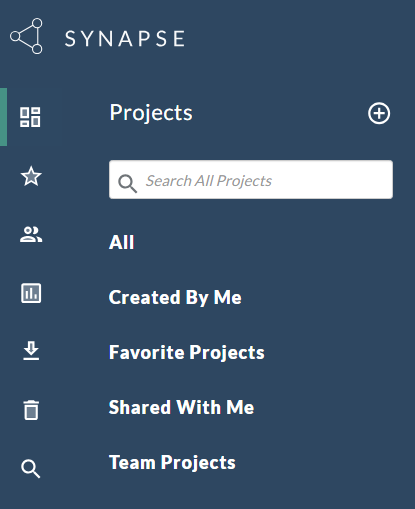

# Account Setup

To begin using Synapse, please follow these steps:

1. Please familiarize yourself with the different [account types available](https://help.synapse.org/docs/Synapse-User-Account-Types.2007072795.html).

2.  **Create an Account:** Start by visiting the [Synapse Documentation Website](https://help.synapse.org/docs/Getting-Started.2055471150.html) and [register for an account](https://www.synapse.org/#!RegisterAccount:0).

3. **Certification Quiz:** To unlock all the features and upload data in Synapse, you must successfully complete a [certification quiz](https://www.synapse.org/#!Quiz:Certification).

:::tip Pro Tip
You can find your Synapse username by navigating to [view your profile](https://www.synapse.org/#!Profile:v).
:::

If you have any questions or need assistance, please submit a ticket to the [DCC Customer Service Desk](https://sagebionetworks.jira.com/servicedesk/customer/portal/17).

4. After creating your account, please inform the DCC so that a team-specific invitation can be sent to you.

5. To join a team, you must accept the invitation by clicking on the link provided in the email and following the instructions on the Synapse team page.

6. **Navigate to Your Projects**: Once you have an account, you can access your projects. These projects are categorized into three types:
   - `Created By Me`: Projects created by you.
   - `Favorite Projects`: Projects you've marked as favorites.
   - `Shared With Me`: Projects you have access to. 
   - `Team Projects`: Projects associated with your research team.

  