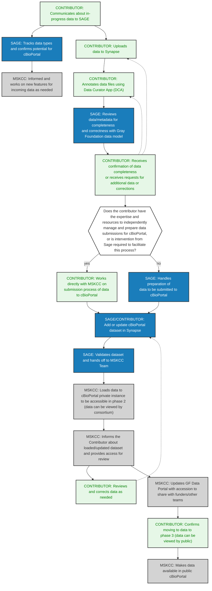

# cBioPortal

This is the workflow for submitting data into cBioPortal for sharing and visualization. 
The steps for contribution are [detailed here](https://github.com/cBioPortal/datahub/blob/master/docs/curation-process.md).

