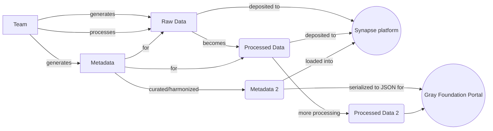

```mermaid
graph LR
    T[Team] -->|generates| R
    T -->|generates| M1[Metadata]
    T -->|processes| R
    R[Raw Data] -->|becomes| P1(Processed Data)
    R -->|deposited to| S((Synapse platform))
    P1 -->|deposited to| S
    M1[Metadata] -->|for| R
    M1 -->|for| P1
    M1 -->|curated/harmonized| M2(Metadata 2)
    M2 -->|loaded into| S
    M2 -->|serialized to JSON for| PORTAL 
    P1 -->|more processing| P2(Processed Data 2)
    P2 --> PORTAL((Gray Foundation Portal))

```
